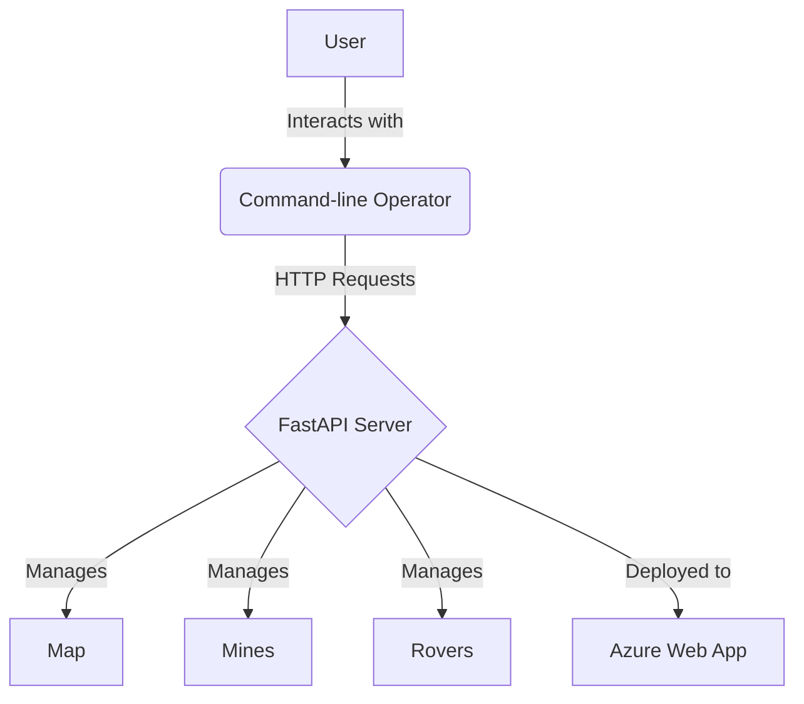
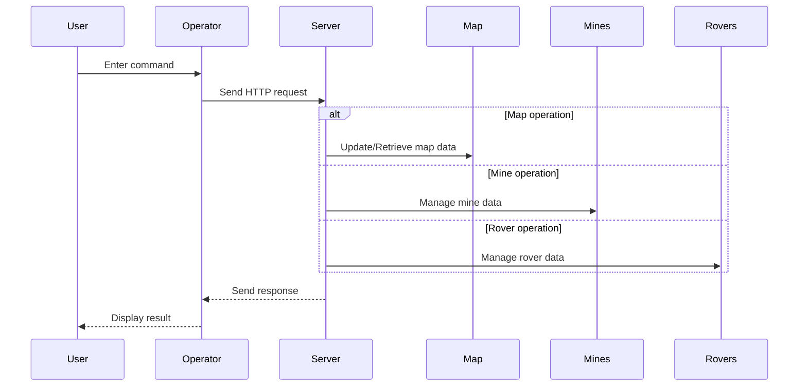

# FastAPI Rover Design Document

## Overview
This Python project simulates rovers navigating a minefield represented as a 2D array, where each cell contains either a mine (non-zero) or is empty (zero). The rover can follow commands like turning left (L), turning right (R), moving forward (M), and digging (D). The code sequentially processes each rover's commands, starting at the initial position (0,0) facing south, and calculates the rover's path on the map. It marks the path with "*" symbols and handles scenarios where rovers encounter mines. If a rover doesn't dig a mine and moves, the mine explodes, and the remaining commands are ignored. The system consists of two main components: a FastAPI HTTP server and a command-line operator. The server manages the simulation state and provides endpoints for controlling rovers, managing mines, and updating the map. The operator serves as a user interface, allowing users to interact with the simulation through various commands.

## Video Demo
https://www.youtube.com/watch?v=TcWUQnB_nxE

## 2. System Architecture

The system follows a client-server architecture, with the following main components:

1. FastAPI Server
2. Command-line Operator
3. Azure Web App (for hosting the server)

### 2.1 System Diagram

## 3. Component Details

### 3.1 FastAPI Server (Server.py)

The server is built using FastAPI and provides the core functionality of the simulation system.

#### Key Features:
- Manages the map, mines, and rovers
- Provides RESTful API endpoints for various operations
- Implements rover movement logic and mine interactions

#### Data Models:
- Map: Represents the 2D minefield
- Mine: Represents a mine with coordinates and serial number
- Rover: Represents a rover with status, position, and moves

#### Endpoints:
- Map operations: GET, PUT
- Mine operations: GET, POST, PUT, DELETE
- Rover operations: GET, POST, PUT, DELETE, dispatch

### 3.2 Command-line Operator (operator_now.py)

The operator provides a user-friendly interface for interacting with the server.

#### Key Features:
- Presents a menu of available commands
- Sends HTTP requests to the server based on user input
- Displays server responses to the user

#### Main Functions:
- getMap(): Retrieves the current map state
- putMap(): Updates the map dimensions
- getMines(), postMine(), putMine(), deleteMine(): Mine management operations
- getrovers(), postRover(), putRover(), deleterover(): Rover management operations
- dispatchRover(): Initiates rover movement simulation

### 3.3 Azure Web App

The FastAPI server is deployed as a web application on Azure.

## 4. Data Flow

## 5. Key Algorithms

### 5.1 Rover Movement Simulation

The `walk_path` function in `Server.py` implements the core logic for simulating rover movement:

1. Initialize rover position and direction
2. For each move in the rover's command sequence:
   - Update rover status and position
   - Handle interactions with mines (digging or exploding)
   - Update the map to reflect the rover's path
3. Generate a path file showing the rover's movement

### 5.2 Mine Digging

The `dig` function simulates the process of a rover attempting to dig a mine:

1. Generate a random PIN
2. Combine PIN with mine serial number
3. Calculate SHA256 hash of the combined string
4. Check if the hash meets the required criteria (e.g., starts with "000000" for rover 1)
5. Repeat if criteria not met

## 6. Deployment

The system is deployed using the following steps:

1. The FastAPI server is containerized using Docker
2. The Docker container is deployed to Azure as a web app
3. The command-line operator is run locally, connecting to the Azure-hosted server

## 7. Future Improvements

1. Implement user authentication and authorization
2. Add a graphical user interface for the operator
3. Implement real-time updates using WebSockets

